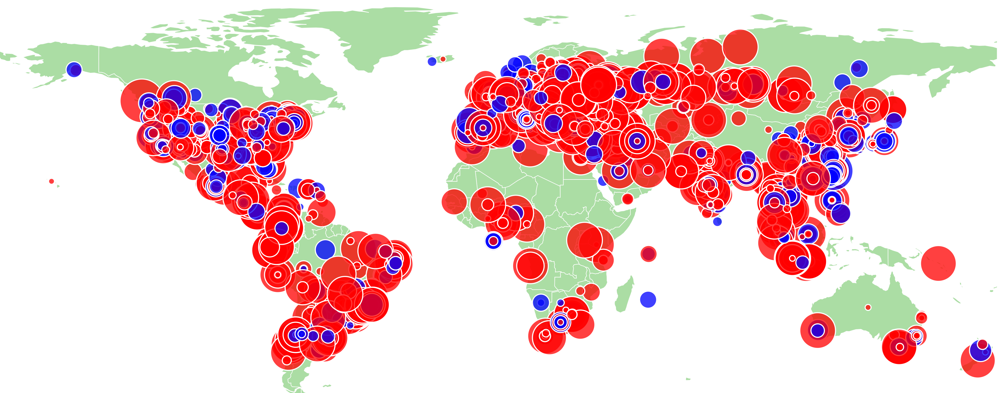
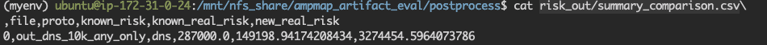
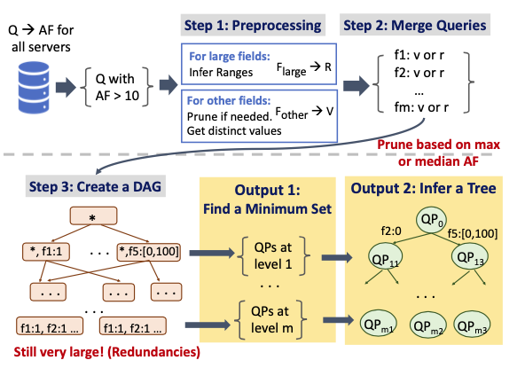

# AmpMap : Accurately Measuring Global Risk of Amplification Attacks

**Authors**: [Soo-Jin Moon](https://soojinmoon.com/), [Yucheng Yin](https://sniperyyc.com/), [Rahul Anand Sharma](https://rahul-anand.github.io/), [Yifei Yuan](http://www.andrew.cmu.edu/user/yifeiy2/), Jonathan M. Spring, [Vyas Sekar](https://users.ece.cmu.edu/~vsekar/)

**Paper**: [Accurately Measuring Global Risk of
Amplification Attacks using AmpMap](https://soojinmoon.com/assets/papers/ampmap_sec21.pdf), To appear in [USENIX Security 2021](https://www.usenix.org/conference/usenixsecurity21). 

**Extended Tech Report:** The [report](https://soojinmoon.com/assets/papers/ampmap_extended_tech_report.pdf) contains pseudocode for our algorithms and analysis. 


<p align="center">
  
</p>
<p align="center">
  Figure 1: Visualizing <b>Amp</b>lification Attack in the World <b>Map</b>
</p>


AmpMap is a low-footprint Internet health monitoring service that can systematically and continuously quantify the amplification DDoS risk to inform
mitigation efforts. To quantify the risk and inform mitigation efforts, AmpMap precisely identifies query patterns that can be abused for amplification attacks. Using AmpMap, we systematically confirmed prior observations and uncovered new-possibly-hidden amplification patterns ripe for abuse. Our [paper](https://soojinmoon.com/assets/papers/ampmap_sec21.pdf) has been accepted to USENIX Security 2021 and also passed the [artifact evaluation](https://www.usenix.org/conference/usenixsecurity21/artifact-evaluation-information). 

In our paper, we scanned thousands of servers for 6 UDP-based protocols, analyzed and visualized our findings, generated signatures using our measurement data, and compared our solution to strawman solutions. This document presents how to run the end-to-end AmpMap measurements and extract useful insights from our dataset. Note that coordinating a large-scale measurement required a lot of care to follow best practices in running our measurements, required careful coordination with the Cloudlab administrators (to inform them of our measurements) and tracking response emails/experiment status.   Hence,  for those interested in running the AmpMap's workflow (without running large-scale measurements),  we also demonstrate how you can leverage the same codebase to run the AmpMap workflow using a local (one DNS server) setup.  Further, for those who just want to analyze our dataset (without running these measurements),  we also released our [anonymized dataset from our measurements](https://cmu.box.com/s/wofp1bcfdmkrs98ctf2cntk846cjqjed) and show how to replicate our visualizations/results using this dataset.


This repo and the documentation below contain the code that we used in the paper. We describe the codebase in detail and walk through the entire workflow in the rest of this documentation. Here is a brief overview of the repo:


<table align="center">

| Folder      | Description |
| :----:        |    :----:   |
| *setup/*      | package installation, local DNS server setup, IP filtering     |
| *src/* | code for running the measurement |
| *analysis/* | post analysis, signature mining (Figure 14), visualization | 


We walk through different workflows of the functionality of the code in this repository.  

1. **Running AmpMap large-scale measurements:** We followed the best practices outlined in Section 6 (Precautions and Disclosure) of the paper. Before running these measurement, refer to our [Disclaimer](#disclaimer). 

2. **Local DNS measurement (against one server):**  We also show how to run AmpMap for a local DNS server. Using this setup, we show how to validate parameter choices and compare the AmpMap algorithm with  strawman solutions. Refer to [Local DNS measurement](#measurement-local) for more details.   

3. **Aggregate analysis:** We demonstrate how to replicate results from  Section 5.1 (Protocol & Server Diversity) and Section 5.2 (Assessing amplification risks) of the paper.  

4. **Pattern analysis:** Given a large-scale measurement dataset, we walk through how to generate patterns (using the workflow in Figure 14) and use these patterns to replicate our figures. Note that this step assumes having access to dataset from large-scale measurements. You can either use the released anonymized dataset or run your own measurements to obtain the data.  

# Table of contents
1. [General Setup](#general-setup)
	* [Basic Setup (NFS and SSH)](#setup-nfs) 
	* [Packages for measurements](#packages-for-measurements) 
	* [Packages for analysis](#packages-for-analysis) 
	* [Obtaining and filtering server IPs](#obtaining-and-filtering-server-ips)
	* [Setup local DNS server](#setup-local)
2. [AmpMap Measurements](#ampmap-measurement)
	* [Large-scale measurements](#large-scale-measurements)
		* [Disclaimer](#disclaimer) 
		* [How to run and AmpMap parameters](#how-to-run-and-ampmap-parameters) 
		* [Output](#output) 
	* [Local DNS measurement](#measurement-local)
		* [How to run](#how-to-run)
		* [Replicating parameter validation](#replicating-parameter-validation)
		* [Comparing with strawman solutions](#comparing-with-strawman-solutions)
3. [Aggregate Analysis (Sections 5.1 & 5.2)](#aggregate-analysis)
	* [Protocol and server diversity](#analysis-proto-server)
	* [Amplification risk](#analysis-amp-risk)
	* [In-depth analysis of DNS](#dns-analysis)
4. [Pattern Analysis (Section 5.3)](#pattern)
	* [Generating patterns (Figure 14)](#pattern-workflow)
	* [Analysis using generated patterns](#pattern-analysis)


# General Setup  

In this section, we would describe how to install necessary packages for measurement/post analysis and steps to obtain server IPs to run large-scale measurements.

## Basic Setup (NFS and SSH) <a name="setup-nfs"></a>

For the rest of the doc, we assumed that you use this github repo ``ampmap/`` as your working directory. Moreover, ``ampmap/`` is set as a shared Network File System (NFS) folder among the servers. 


**NFS:** Recall that our setup uses a controller-measurer architecture where 1 measurement node is a controller and the rest of nodes are measurers, sending packets to network servers.  In our measurements, we used 1 controller and 30 measurers (the number of measurers can be customized based on your setup).  These nodes (controller-measurers) communicate via the NFS, and hence, we need to install NFS across controller and measurers. Follow the instructions [here](https://vitux.com/install-nfs-server-and-client-on-ubuntu/) to configure NFS for your setup. 

**SSH:** Further, we assume that the controller has the ability to SSH into measurers as a root.  


## Packages for measurements  
Run the following command for any server responsible for ***measurement***:

```Bash
cd setup/
./node.sh 
```

This script installs a python=3.6 virtual environment named "myenv3" with pre-installed necessary packages such as scapy. The virtualevn will be activated automatically when switching to the root privilege, i.e., you should see the similar prompt as below after you enter ``sudo su``:

```Console
(mypy3) root@node-0: /users/ubuntu
```


## Packages for analysis   
Run the following command for the node responsible for analysis (both aggregate and pattern). 

Firstly, follow the instructions [here](https://docs.anaconda.com/anaconda/install/) to install anaconda.

Then run the following command to create a virtualenv named ``ampmap`` and install the dependencies.

```Bash
cd setup/
./node_analysis.sh
```


## Obtaining and filtering server IPs 

**Note: This is necessary only if you would like to run large-scale measurement.**

In this subsection, we would describe how we filter server IPs for measurement based on the raw IP list obtained from the public dataset (e.g., [Shodan](https://www.shodan.io/), [Censys](https://censys.io/)) for different protocols. Considering the large size of the raw IP list, we can use the same controller-measurer architecture described in [Basic Setup (NFS and SSH)](#setup-nfs) to parallelize and speed up the IP filtering process. At a high level, the controller splits the *randomized* raw IP list into several sub-lists, each measurer takes the sub-list, filters and eventually the controller combines the sub-filtered lists across measurers into the final filtered list. 

The purpose of filtering is to prune out inactive servers (e.g., those that do not respond to *dig* for DNS) or owned by the military or government. For certain protocols (SNMP, NTP) that have different modes of operation with distinct formats, we consider two notions of active server, whether the server responds to (1) "any" of the modes (OR filter); or (2) "all" of them (AND filter).  This IP filtering process supports both schemes. The detailed statistic on the number of servers we scanned can be found in Table 4 of the [paper](https://soojinmoon.com/assets/papers/ampmap_sec21.pdf).


Alternatively, you could run the IP filtering based on your own raw IP list:

1. Log into the controller machine
2. `sudo su`: run as super user since sending packets using scapy requires root privilege.
3. `cd setup/IP_filtering`: go to IP filtering folder.
4. Put your raw ips in a file `[protocol]_raw_ips_total.txt` and replace `[protocol]` with your desired protocol. **Put one single IP for each line.** Currently, IP filtering supports **DNS, NTP\_OR, NTP\_AND, SNMP\_OR, SNMP\_AND, Memcached, Chargen, SSDP** (case insensitive). You can easily extend the filter to other protocols by adding filtering function in `job.py`. An example `[protocol]_raw_ips_total.txt` looks like 

	```text
	A.A.A.A
	B.B.B.B
	C.C.C.C
	```
	
5. In `measurer.ini`, replace `numMeasurers` with actual number of measurers and `A.A.A.A` with your measurer's IPv4 address. An exmaple `measurer.ini` looks like

	```ini
	[measurers]
	numMeasurers=2
	
	[Measurer_1]
	ip=A.A.A.A
	
	[Measurer_2]
	ip=B.B.B.B
	```
	
6. In `parameters.ini`, replace `ip_filter_dir` with the absolute path of `setup/IP_filtering`. Recall that `ampmap/` is a shared NFS folder between servers.
7. `python3 controller.py [protocol]` and replace `[protocol]` with your desired protocol.

**The final filtered list would be `[protocol]_filter_total.txt`**. It will also generate a few intermediate folders:

* **[protocol]\_raw\_ips\_split/**: the splitted sub-list from the raw input list.
* **[protocol]\_filter\_split/**: the filtered sub-list from each measurer.
* **out/**: logs and command files for synchronization between the controller and measures.


## Setting up a local DNS server  <a name="setup-local"></a>
	
**Note: This is necessary only if you would like to run local DNS measurements.**

Run the following command for setting up a local DNS server:

```Bash
cd setup/DNS
./setup_dns.sh
```

which will install Bind9 on the server. Note that this DNS server should only be accessible from the internal network due to security concerns. To achieve this, add the whitelist in the *goodclients* section of the file `named.conf.options`.


# AmpMap Measurements 

We now describe how to run large-scale measurements. Refer to our [paper](https://soojinmoon.com/assets/papers/ampmap_sec21.pdf) for more details on how AmpMap algorithms and workflow work. As mentioned, we run measurements using a controller-measurer architecture to parallelize and speed up the measurement process. The high-level workflow is :

1. The controller takes the filtered IP list ([Obtaining and filtering IPs](#obtaining-and-filtering-server-ips)) and assigns IPs to the measurers in a round-robin way. 
2. The controller initiates a three-stage pipeline: Random State, Probing Stage, Per-Field Search (PFS). 
3. In each stage, each measurer sends a fixed number of queries (user-defined parameters) to the assigned server IPs, gets the responses, and stores the observed amplification factors (AFs).  
4. The controller keeps monitoring the progress of each measurer. When all measurers finish their jobs for one stage (or when the timeout occurs), the controller initiates the next stage in the pipeline.

A detailed description algorithm can be found in our [paper](https://soojinmoon.com/assets/papers/ampmap_sec21.pdf).  Section 6 of the paper also discusses the precautions and best practices we followed in running our measurements. As an example, we make a conscious effort to make AmpMap a low-footpring system; i.e., the network load is low: 48 kbps (egress) across all measurers and 1.6 kbps per measurer, given that we impose a limit of 1 query per 5s for each server with a timeout of 2 seconds (i.e., 7 seconds per query), with ~10K servers and 30 measurers.

## Disclaimer  

The AmpMap team took a lot of care in designing and running our measurements as described in Section 6 of the [paper](https://soojinmoon.com/assets/papers/ampmap_sec21.pdf). For instance,  we followed best practices in running our measurements (e.g., not overload the server, not spoof the IPs), required careful coordination with the Cloudlab administrators where we inform them of our measurements, and tracking response emails/experiments. 
Running AmpMap can generate large network footprint and you can get abuse complaints if you run AmpMap in the wild without careful design/configuration. Understand this risk before you run AmpMap. 


## Large-scale measurements


1. Obtain the server IPs from following instructions [here](#obtaining-and-filtering-server-ips)
2. SSH into the controller machine
3. `sudo su`: Run as super user since sending packets using scapy requires root privilege.
4. `cd src/`: Go to the measurement folder.
5. In the `common_path.ini`, replace `ampmap/src_dir` with the absolute path of the `src/` folder. Recall that `ampmap/` is a shared NFS folder between servers.
6. For the target [protocol], change **servers.ini** and **measurers.ini** located at `field_inputs_[protocol]`:
	* **servers.ini**: replace `numServers` with actual number of servers and `A.A.A.A` with your [protocol] server's IPv4 address. An example **servers.ini** will look like:
	
		```ini
		[servers]
		numServers=2
		
		[Server_1]
		ip=A.A.A.A
		
		[Server_2]
		ip=B.B.B.B
		```
		
	* **measurer.ini**: replace `numMeasurers` with actual number of measurers and `A.A.A.A` with your measurer's IPv4 address.

		```ini
		[measurers]
		numMeasurers=2
		
		[Measurer_1]
		ip=A.A.A.A
		
		[Measurer_2]
		ip=B.B.B.B
		```

### How to run and AmpMap parameters  

Run measurement for the target [protocol]. Here is one sample command we use for DNS measurement in the paper with total budget 1500 queries per server and (random, probe, PFS) = (675, 150, 675). You can refer to the file `ampmap/src/out/logs/time.txt` for monitoring the progress of each batch. 

```Bash
python3 controller.py --measurement --in_dir field_inputs_dns --update_db_at_once 60 --proto DNS  
--block_size 500 --per_server_budget 1500 --num_probe 150  --per_server_random_sample 675  
--probe_numcluster 20  --cluster_weight_hybrid --choose_K 1 --choose_K_max_val  
--query_wait 5  --server_timeout 2  --random_timeout 2 --probe_timeout 1 --pfs_timeout 2
```


Here are some brief explanations about the parameters we use if you would like to try different combinations.
	
|         Parameters         |  Specification      |
|:----:|:----:|
|          --in\_dir          |  Specificies the configuration folder for the target [protocol], within the folder, <br> <ul><li>**fields.ini**: specifies the fields in target [protocol] that AmpMap will search for</li><li>**measurer.ini**: specifies the number of measures and measurer IPs</li><li>**servers.ini**: specifies the number of [protocol] servers and server IPs</li></ul> **Note**:  For our 10K measurements, we just need to specify 10K servers in **servers.ini** and 30 measurer IPs in measurer.ini  |
|     --update\_db\_at\_once    | how many queries we write at once from buffer to the file on the disk |                     
|           --proto          | protocol we are testing, in this case, DNS |
|        --block\_size        | how many servers we simultaneously set as targets for AmpMap |
|     --per\_server\_budget    | the total budget of AmpMap for each server |
|         --num\_probe        | the budget for probe phase |
| --per\_server\_random\_sample | the budget for random phase |
|     --probe\_numcluster     | the number of clusters (i.e., 20) to cluster high amplification-inducing queries |
|   --cluster\_weight\_hybrid  | the hybrid choice in how we pick the number of clusters |
|         --choose\_K         | the number of starting point for |
|      --chose\_K\_max\_val     | how to choose a starting point (we pick the one that gives the maximum AF) for each server  |
|        --query\_wait        | time to wait between two consecutive queries, in seconds |
|      --server\_timeout      | timeout in the scapy send function for sending DNS queries, in seconds |
|      --random\_timeout      | timeout for random phase, in hours |
|       --probe\_timeout      | timeout for probe phase, in hours |        
|      --pfs\_timeout       | timeout for pfs phase, in hours |


**How to select the batch\_size:** Our measurement in the [paper](https://soojinmoon.com/assets/papers/ampmap_sec21.pdf) uses 31 nodes (1 controller + 30 measurers) to measure ~10K servers per protocol. We used [Cloudlab](https://www.cloudlab.us/) as our benchmark platform with each node equipped with ~16 cores.   Accordingly, we run the measurement in batch_size=500 which leads to 16 servers (16 processes) per measurer at the same time. Please limit your number of processes for each measurer otherwise the experiments may fail accidentally. 


### Output <a name="output-large"></a>

The output of one run is located at `out/`  with the following key folders:

* **out/query**: query results without being ranked in a json format. these json files will be updated during the measurements.  
* **out/searchout**: query results where queries are ranked in amplification factor from high to low in json format. These files will get generated after the entire measurements are completed. An example searchout file looks like:

	<p align="center">
	  
	</p>
	<p align="center">
	  Figure 2: An example searchout file
	</p>
	
Other folder (inside the `out/` folder) are for intermediate results during the run which are not directly related to the result.

* **out/command**: command file used for synchronization between the controller and measurers.
* **out/logs**: log files for error logs (if any)
* **pcap/**: pcap files for every query/response each measurer sends/receives.
	
	


## Local DNS measurements <a name="measurement-local"></a>


### How to run  <a name="run-local"></a>

Alternatively, instead of running internet-wide measurements, you could set up your own DNS server and run extensive tests as you wish. The general workflow is almost identical to that of the [large-scale measurements](#large-scale-measurements) with only a few differences.

1. [Set up the local DNS server](#set-up-local-dns-server) before running the measurement.
2. SSH into the controller machine
3. `sudo su`: run as super user since sending packets using scapy requires root privilege.
4. `cd src/`: go to measurement folder.
5. In `common_path.ini`, replace `src_dir` with the absolute path of `src/` folder. Recall that `ampmap/` is a shared NFS folder between servers.
6. For the target [protocol], change **servers.ini** and **measurers.ini** located at `field_inputs_[protocol]`:
	* **servers.ini**: replace `numServers` with actual number of servers and `A.A.A.A` with your [protocol] server's IPv4 address. An example **servers.ini** will look like:
	
		```ini
		[servers]
		numServers=2
		
		[Server_1]
		ip=A.A.A.A
		
		[Server_2]
		ip=B.B.B.B
		```
		
	* **measurer.ini**: replace `numMeasurers` with actual number of measurers and `A.A.A.A` with your measurer's IPv4 address.

		```ini
		[measurers]
		numMeasurers=2
		
		[Measurer_1]
		ip=A.A.A.A
		
		[Measurer_2]
		ip=B.B.B.B
		```
7. Run the measurement. For instance, we used the command below for DNS with total budget 1500 queries per server and (random, probe, PFS) = (750, 0, 750), with only 1 measurer and 1 local DNS server:

	```Bash
	python3 controller.py --measurement --in_dir field_inputs_dns_db2 --update_db_at_once 60 --proto DNS  
	--block_size 1 --per_server_budget 1500 --num_probe 0  --per_server_random_sample 750  
	--probe_numcluster 20  --cluster_weight_hybrid --choose_K 1 --choose_K_max_val  
	--query_wait 0.1 --server_timeout 0.2  --random_timeout 0.2 --probe_timeout 0.1 --pfs_timeout 0.2
	```

In this local setup, we only have one local server. Hence, we do not need to run the Probing Stage, that shares insights across servers.  

### Replicating parameter validation 

We now show how to replicate Figure 18 that shows validated the choice of our total budget. We first need to generate data by running the AmpMap algorithm for one server with varying total budgets. 


**Generating data:** 

1. SSH into the controller machine  
2. ```cd src``` (We assume that you correctly [configured](#run-local)  servers.ini and measurers.ini files) 
3. ```./run_param_choice_total_budget.sh results_out SERVER_IP``` where ```results_out``` is the main output directory. This script runs 20 runs for each configuration and takes 8+ hours to run. Hence, we suggest that you run   ```nohup ./run_param_choice_total_budget.sh  &```  For your reference, we ran the same script and generated the sample output. From this [link](https://cmu.box.com/s/wofp1bcfdmkrs98ctf2cntk846cjqjed), download ```param_validation.tar.gz``` and untar under the ```src``` directory. ```results_out_pregen``` contains the sample output. 

4. The script outputs these folders : 
	- ```results_out/results_urlset1``` : data for the left column of Figure 18. This uses the input folder ```field_inputs_dns``` which is the default input for DNS. 
	- ```results_out/results_urlset1-noAnyTxtRRSIG```: data  for right column of Figure 18. This uses the input folder ```field_inputs_dns_noAnyTxtRRSIG_analysis``` which just removes RRSIG (46), ANY (255), and TXT (16) record types from the original field.ini in ```field_inputs_dns```. 


**Generating the figure:** 

We now need to compare the pattern coverage across different parameter choices. To do so, we need ground-truth signatures to compare against. Recall from our paper that sampled 2M queries to simulate ground-truth signatures. We release these signatures in the [Box link](https://cmu.box.com/s/wofp1bcfdmkrs98ctf2cntk846cjqjed). You can download and untar ```param_validation.tar.gz``` (out_GT folder). 

1. We need to generate the summary statistics. We show how to generate stats using pre-generated dataset. If you would like to use the data you generated, replace ```results_out_pregen``` with ```results_out```.   
	- For the left group: ```python compare_diff_algo.py  results_out_pregen/results_urlset1-noAnyTxtRRSIG/ urlset1_original.csv```
	- For the right group: ```python compare_diff_algo.py results_out_pregen/results_urlset1-noAnyTxtRRSIG/ urlset1_disbleRRSIG-TXT-ANY.csv``` 
The outputs are two CSVs: urlset1_original.csv, urlset1_disbleRRSIG-TXT-ANY.csv

2. mv these two CSVs ```../postprocess``` 
4. Run ```python figs18_param_choice.py ```. This will generate ```./figs/fig18_part_total_param.pdf``` 


### Comparing with strawman solutions

We now show how you can compared AmpMap to the strawman solutions. This assumes that you already ran the [Replicating parameter validation](#replicating-parameter-validation). We start with a strategy that randomly generate protocol-compliant packets (i.e., random strategy). 

1. (For testing) Run random strategy using 1,500 as a budget. As usual, the output is under ```./out```. 

```Bash
python3 controller.py --per_server_random_sample 1500 --num_probe 0 --per_server_budget 1500 --in_dir field_inputs_dns 
--update_db_at_once 20 --query_wait 0.1 --measurement --server_timeout 0.2 --proto DNS --choose_K 0
``` 


2. We can now generate multiple runs to compare witih AmpMap. Run ```./run_strawman.sh results_out ```. As this also takes 1-3 hours, we recommend you run with ```nohup```.  As we've done for the AmpMap runs, we pre-generated data for these runs under ```results_out_pregen/results_urlset1_strawman```.  Note, that for us to compare strawman solutions, we measured relative performance across 1K servers in the wild (Figure 20). However, in case you can't run a large-scale experiment, we will again generate a similar figure as Figure 18 to compare random strategy. However, this is not the same type of Figure as Figure 20 but rather over-fitting it to one server instance. 

3. ```mv results_out ../postprocess```. Run  ```python compare_diff_algo.py  results_out/results_urlset1_strawman/urlset1_random.csv```. If you would like to run the same script with our pre-generated data, you can repliace ```results_out``` with ```results_out_pregen```. 

The above steps show how to compare with a random strategy. You can run the similar procedure to compare with the simulated annealing. To run simulated annealing once, you can use the command below and modify ```run_strawman.sh``` accordingly. 

```Bash
python3 controller.py --per_server_random_sample 1500 --num_probe 0 --per_server_budget 1500 --in_dir field_inputs_dns 
--update_db_at_once 20 --query_wait 0.1 --measurement --server_timeout 0.2 --proto DNS --choose_K 0 --simulated
```

# Aggregate analysis (Sections 5.1, 5.2) <a name="aggregate-analysis"></a>

**Anonymized dataset:*** Access this [link](https://cmu.box.com/s/wofp1bcfdmkrs98ctf2cntk846cjqjed) and download ```anonymized-dataset.tar.gz``` and untar under the ```postprocess``` directory. 

We have one script that generates all figures and tables below. First, activate the conda environment you set up for analysis: ```conda activate ampmap ``` 
Running ```./run_part2_figures.sh``` will generate: 
1. Figure 9: ```./figs/Fig9_max_AF_protocols.pdf```
2. Figure 10: ```./figs/Fig10_AF_Distribution_yr2020.pdf```
3. Tables 5 + 6 (DNS) : ```risk_out/summary_comparison.csv```
4. Figure 12: ```./figs/dns/signature_effective_server_percent_reduction_full.pdf```
5. Figure 13: ```./figs/Figure13_dns_stacked_bar.pdf``` 

We also present a more detailed description of how to run each component and explanation of the generated outputs (and some intermediate files). 

## Protocol and Server Diversity  <a name="analysis-proto-server"></a>

**Figures 9, 10:** ```python fig9_10_protocol_summary.py``` generates these two figures and some intermediate files storing the  maximum AF for each server given a protocol. If this intermediate file already exists, our script will skip generating these intermediate files. 


## Amplification Risk Quantification 

**Table 5, 6:** Tables 5, 6 quantifies the mis-estimation of known risk if we used prior work and missed risk from unknown (new) patterns, respectively. While we show how to generate numbers for DNS, the script/workflow is general for other protocols.  ```postprocess/Known_patterns``` folder contains the patterns identified by prior work. Specifically, we will show how we can generate the mis-estimation of the risk for DNS if we used the ANY and EDNS0 patterns (these are the first rows in both Table 5 and 6). We wll use ```known_patterns/dns_any_only.json``` which specifies ANY and EDNS0 pattern.  

Run the command below to calculate the risk. It computes the AF across servers using the known patterns and the total risk using other combinations of EDNS and record types. 

```Bash 
python  querypattern_risk_metric_v3.py  --qp_dir ./data_dir/query_searchout_DNS_20200516/  --sig_input_file ./known_patterns/dns_any_only.json   
--proto dns --out_dir risk_out/out_dns_10k_any_only 
```

Then, run ```python compare_risk.py --risk_dir risk_out```. This generates the summary file ```risk_out/summary_comparison.csv``` as shown below.  
	
 
	
	
This shows that risk by prior work is 287K  and risk from prior known patterns estimated by Ampmap's data is 149K (first row of Table 5). Similarly, we see that the total risk across patterns from other patterns is 3274K (first row of Table 6) 


**Figure 12:** Figure 12 shows the % of DNS servers that are susceptible to amplification even if we use the recommendation by prior works.  

```Bash 
python fig12_analyze_proto.py --qps_data_folder data_dir/query_searchout_DNS_20200516/ --proto dns 
--alias dns  --intermediate_data_folder intermediate_files --out_dir figs --signature
``` 

This code generates many other files and figures (under <./figs/dns>), but only Figure 12 was included in our paper. Also, this will generate intermediate files (figs/dns/d(0-3))  used to generate other figures (Figure 13 that we describe shortly). Figure 12 can be found in: ```./figs/dns/signature_effective_server_percent_reduction_full.pdf```


## In-depth analysis of DNS  <a name="dns-analysis"></a>


**Figure 13:** Figure 13 just shows % of servers that can induce high AF with various record types. 
``` python fig13_dns_stackekd_bar.py --out_dir figs/ --parsed_data figs/dns/```. 

You can find the figure in ```./figs/Figure13_dns_stacked_bar.pdf```. 


# Pattern Analysis (Section 5.3) <a name="pattern"></a>

We now show how to run Figure 14 workflow that generates the pattern or signatures for various protocols. Before running the workflow below, make sure you are already in the node you set up for analysis, and run the following commands :  ```conda activate ampmap ```

We will run this workflow using [anonymized dataset](https://cmu.box.com/s/wofp1bcfdmkrs98ctf2cntk846cjqjed) and untar under ```postprocess/data_dir```. 

## Generating Patterns <a name="pattern-workflow"></a>

<p align="center">
  
</p>
<p align="center">
  Figure 3: Pattern Generation
</p>

**Parameters:** ```config/params.py``` defines the parameters and folder location for each protocol.  We describe the parameters here briefly: 
* kl_thresh (default: 0.08): KL divergence threshold to identify critical and non-critical fields.  A higher threshold allows more fields to be considered.
* af_thresh (default:10): defines that queries with AF > af_thresh are high amplification queries.
* data_path (default: data_dir)  : the location of input data folder.
* sv_path (default: signatures)  : the location of output  signatures folder.
* ipp: for each protocol, it’s a field information file
* proto_name: location of the actual folder containing the data

**How to run:** Run ```bash run.sh <protocol_name>```
where the supported <protocol_name>s are:  dns, ssdp, ntp_cnt, ntp_cnt_or, ntp_pvt, ntp_pvt_or, ntp_normal, ntp_normal_or, snmp_next, snmp_next_or, snmp_bulk, snmp_bulk_or, snmp_get, snmp_get_or, chargen, memcached. 

It will generate a corresponding folder in the <signatures> directory.  Subsequent runs for the same protocol will reuse some files to speed up the computation. 


**Run-Time Estimates:** <dns> takes roughly around 7-8 hours for 10,000 servers data. For other protocol, run time varies between 20 mins to couple of hours. 

**Outputs:** We now briefly describe the files generated by this script using DNS as an example.  Briefly re-capping Section 5.3 (Summarizing and analyzing query patterns) is helpful to understand these files below. 

* `all_QPS.csv`: Contains all query patterns with their corresponding minimum, maximum, and median AFs.  Specifically for DNS we also have dnssec_QPS.csv and nondnssec_QPS.csv denoting QPs for only dnssec enabled URLs and non-dnssec enabled URLs respectively (Recall that we discuss in the paper -- $5.3 -- how we generate signatures separately for DNSSEC on vs off). 
* `All_Queries.csv`: contains all queries after converting range field to bins
* We also generate many intermediate files. These include :  `klinfo.csv, ignored.csv, freqcount.npz, range.npy, sigs.npz`.  These files contain information about KL divergence thresholds, ignored fields, frequency counts, etc. 
* `DAG_QPS_depth_max.npy`: Now, recall that we can prune these patterns baked on the median or the maximum AF. This file contains the graph or setcover information for QPs with maximum AF greater than 10.
* `DAG_QPS_depth_median.npy`: Contains the graph or set cover information for QPs with median AF > 10.

Also, note that if there are no queries with high AF some of these files will not be generated (e.g., for protocols like NTP normal). While our workflow and script is general, there are minor protocol-level implementation differences (not differences in the fundamental techniques used).  
* DNS: Split  the URLs into dnssec and non-dnssec and then learn the signatures independently for both sets.
* SNMP: Due to very large integer values, they are mapped to an approximate integer by taking log (base 2)  to speed up the computation and memory requirements.

For your reference, we have pre-generated signatures under ```signatures-pregen.tar.gz``` under the provided Box link. You can let it run and wait for the results or alternatively, you can proceed to the next phase to generate figures if needed.  


## Analysis using generated patterns  <a name="pattern-analysis"></a> 

Figure 15 uses the generated DNS signatures. As described in $5.3, we need to do this for every "depth." However, this specific figure was generated for depth 2 (which just means 8 fields are left concrete and the rest are wildcarded). Hence, we will show how to generate figures and csvs for this specific depth for DNS. 

```Bash 
python querypattern_plot.py --proto dns --plot_root_dir figs  --depth 2 
--qp_dir signatures-pregen/query_searchout_DNS_20200516_out_KL_0.08_AF_10.0/  
--depth_pq_file dnssec_DAG_QPS_depth_median.npy --DNSSEC_True
```

Replace ```signatures-pregen``` with ```signatures``` if  you would like to use the patterns you generated using our script and not use the pre-generated patterns. 

We describe the parameters here briefly: 
* `plot_root_dir`: output different for plots 
* `depth` : correlated with the number of fields to wildcard; here, the leaves had 9 concrete fields depth 1 means 8 fields are left concrete and 1 field is wild-carded 
* `qp_dir`  : the location of query patterns. We use the pre-generated ones in <signatures/query_searchout_DNS_20200516_out_KL_0.08_AF_10.0/> 
* `depth_pq_file`  : which query pattern file to use. On page 11 of the paper in Section 5.3, we discuss how you can prune the candidates patterns based on median or maximum AF.  Here, we use the query patterns pruned based on the median AF.
* `DNSSEC_True` : doing this for DNSSEC patterns  

**Output:** This script generates many files under ```./figs/dns/depth_2.``` Figure 15 is ```figs/dns/depth_2/boxplot_depth_2_all_rank_by_median.pdf```. You can view the query pattern information in ```figs/dns/depth_2/QPs_depth_2.csv``` where [-1.0] means wildcard 


